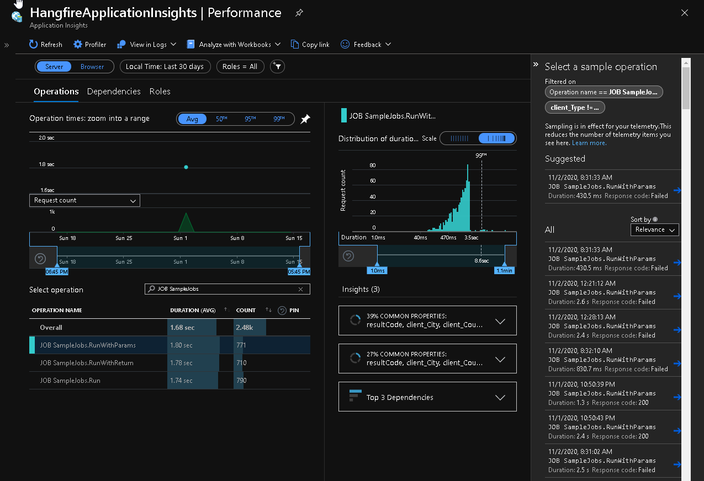

[](https://www.nuget.org/packages?q=Hangfire.Extensions.ApplicationInsights) 

# Hangfire.Extensions.ApplicationInsights
Provides Jobs as Application Insight requests.



## Install Package
This assumes you already have `Hangfire` and `Microsoft.ApplicationInsights` already installed and configured.

First install the `Hangfire.Extensions.ApplicationInsights` NuGet package:
```ps
Install-Package Hangfire.Extensions.ApplicationInsights
```

Add the following line `ConfigureService` add the following
```cs
services.AddHangfireApplicationInsights();
```

See [Sample Project](./Sample) for full example.
